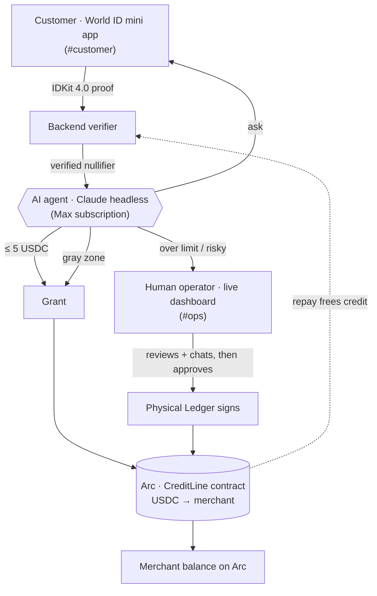
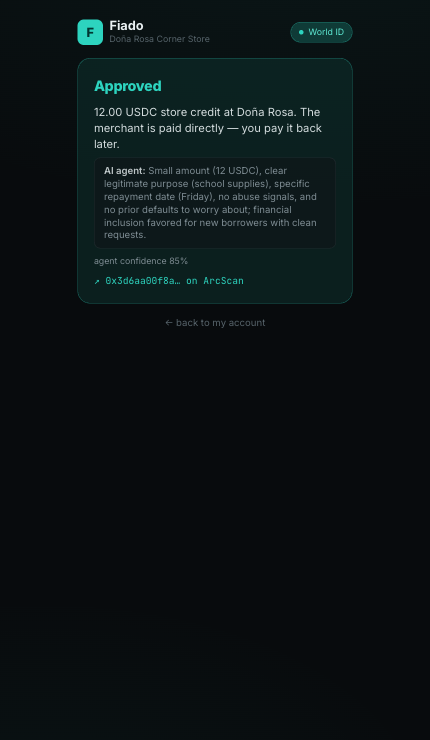
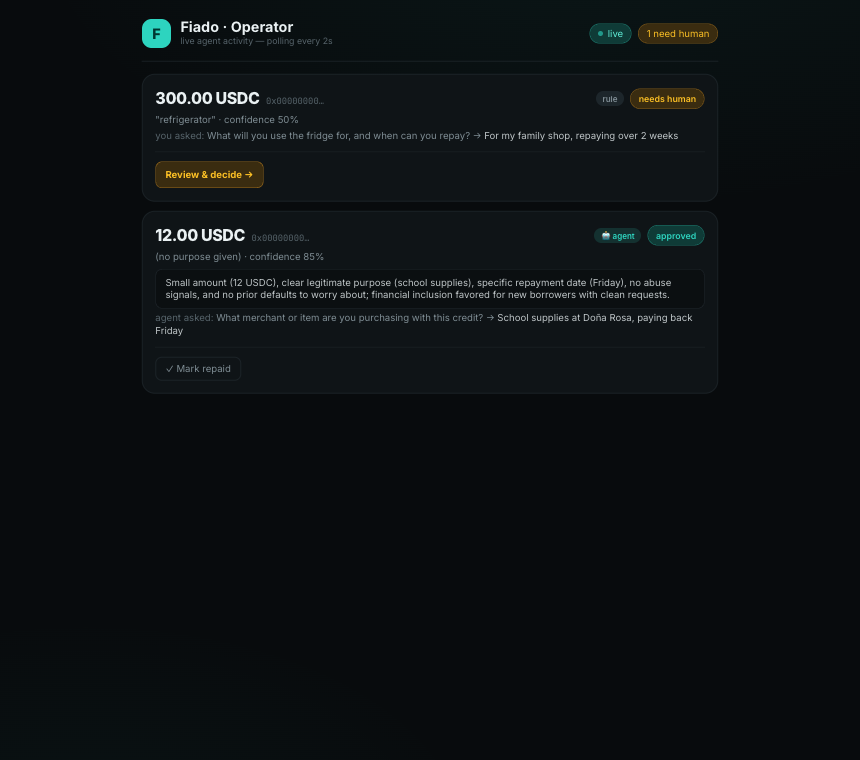
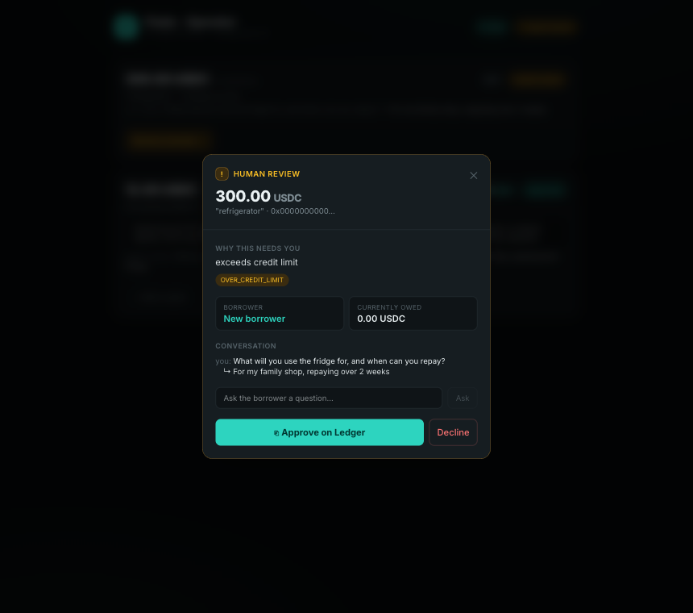

# Fiado

> **Verified-human store credit, underwritten by an AI agent, settled on-chain.**
> A real person (World ID) gets instant "buy now, pay later" — the merchant is
> paid directly in USDC, the customer never touches cash. An AI agent approves
> the everyday store-credit tabs on its own; a human approves the big or risky ones on a
> physical Ledger.

ETHGlobal New York 2026 prototype. Clean-room build — not production code.

## One line

**One verified human, one credit line.** World ID enforces personhood, an **AI
agent** (Claude, running on a local Max subscription) underwrites each request
within hard limits, **Arc** settles USDC directly to the merchant, and a
**physical Ledger** signs the agent's spending mandate and approves anything that
escapes it.

## The decision flow

```
A store-credit request comes in →
  ≤ 5 USDC, no open balance      → auto-granted instantly        (rule)
  gray zone (e.g. 12 USDC)       → the AI agent decides:          (Claude)
        grant · ask one question · escalate
  > the credit limit / risky     → escalate to a human           (rule + agent judgement)
                                    who reviews, can chat with the
                                    customer, and approves on a Ledger
```

Two hard guarantees no AI can override, enforced on-chain by the contract:
**one active line per verified human**, and **no new credit while a balance is
owed** (one open tab at a time, until repaid).

## How the AI agent works

The agent's brain is the **`claude` CLI spawned headless** by the backend, with
`ANTHROPIC_API_KEY` stripped so it authenticates via the developer's **Max
subscription** — no API key, no per-call cost. It runs Haiku with a clean,
MCP-free system prompt and returns a structured decision
(`grant · decline · ask · escalate` + reasoning + confidence). The agent only
reasons **inside** the deterministic guardrails (small tabs are auto-granted
upstream, over-cap requests are force-escalated) and can never widen a limit — the
policy and the smart contract enforce the bounds. If the agent is ever
unavailable, the backend falls back to a deterministic policy.

## Sponsors (3, all load-bearing)

| Sponsor | Role |
| --- | --- |
| **World ID 4.0** | Proof of personhood — one verified human = one credit line. Anti-Sybil. The product's moat; it breaks without it. Live via IDKit 4.0 (QR / deeplink). |
| **Arc / Circle** | The `CreditLine` smart contract + USDC settled **directly to the merchant**. The payment rail and the on-chain enforcement layer. |
| **Ledger** (physical) | Signs the agent's spending mandate once, and approves every human-reviewed escalation. Hardware-gated autonomy. |

## Architecture



- **World ID** answers *who* (a unique, verified human; one line each).
- **The agent** answers *what* (grant / ask / escalate, with reasoning).
- **Ledger** answers *is this allowed* (signs the mandate once; approves exceptions).
- **The Arc contract** enforces every bound on-chain — the agent cannot widen a cap.

## The three surfaces (one app, hash-routed)

| URL | Who | What |
| --- | --- | --- |
| `#customer` | Customer (phone) | Verify with World ID → see standing → request credit → answer the agent's question if asked |
| _default_ `/` (`#ops`) | Operator (laptop) | Live feed of every request + the agent's decision in real time; review & decide escalations on the Ledger; mark tabs repaid |
| `#demo` | — | Scripted mission-control (backup narrative) |

### Customer mini app


### Live operator dashboard + human review



## Monorepo

| Path | Contents |
| --- | --- |
| `contracts/` | `CreditLine.sol` + 17 Foundry tests + deploy script |
| `backend/` | World ID verify (IDKit 4.0 / `/api/v4/verify/{rp_id}`), credit-request state machine, **AI agent brain** (`brain.ts`), deterministic policy fallback, Arc client + RP-signature signing |
| `app/` | The three surfaces: `CustomerView`, `OperatorDashboard`, scripted `App` |
| `docs/` | Architecture, demo script, known limitations / Q&A |
| `feedback/` | `ledger.md` — Ledger SDK/docs feedback |

## Deployed (Arc Testnet · chainId 5042002)

- **CreditLine:** [`0x0068589C0F011c9EB2d054293d6dB8594dc5031e`](https://testnet.arcscan.app/address/0x0068589C0F011c9EB2d054293d6dB8594dc5031e)
- USDC (ERC-20, 6 dec): `0x3600000000000000000000000000000000000000`
- World ID 4.0 app `app_dbdf51eef4a0dc803d92b3452fdf140b` · RP `rp_eb84e52230763d46`
- Proof tx — `openLine` accepted with a backend signature, on-chain:
  [`0xc4b2e06f…`](https://testnet.arcscan.app/tx/0xc4b2e06fe74a02cad0bbfcbc2c4e84213851a647cdd75a27e604931cf7cfa42e)

## What is real vs mocked

- **Real, proven on-chain:** `CreditLine` on Arc; merchant registration + USDC
  pool; the agent mandate **signed on a physical Ledger**; the **AUTO** path
  (`autoDisburse`, no human) and the **ESCALATE** path (Ledger-confirmed
  `approveAndDisburse`). Merchant balance moved on-chain across real runs.
- **Real World ID 4.0 scan:** IDKit 4.0 in the mini app → World App → backend
  verifies the proof via `/api/v4/verify/{rp_id}`. Verified end-to-end with a
  real scan (`ok=true`).
- **Real AI underwriting:** the gray-zone decision is a live Claude call (Max
  subscription), with the deterministic policy as a fallback.
- **Real credit-limit enforcement:** one open tab per human until repaid;
  the operator marks repayment, which frees credit and repays on-chain.
- **Scaled for demo:** on-chain settlement = displayed amount ÷ `DEMO_SCALE_DIVISOR`
  so one testnet faucet covers the demo. The mechanism is identical at 1:1.
- **Honest scope:** the request/decision "messaging" runs through the backend
  state machine (the contract settles + enforces caps, it is not an on-chain
  message bus). Ledger uses `personal_sign` (the device shows a signing request,
  not an ERC-7730 Clear-Signed amount). See [docs/known-limitations.md](docs/known-limitations.md).

## Run it

Everything runs locally (the agent spawns the local `claude` CLI on a Max login);
a tunnel exposes the built app for the live World ID scan.

```bash
# contracts
cd contracts && forge test

# backend (World verify, agent, Arc orchestration) — :3001
cd backend && npm i && cp ../.env.example .env   # fill in the values
npm run dev

# app — build + serve (the World ID flow needs the production build)
cd app && npm i && npm run build && npm run preview -- --port 4173

# expose for a phone scan
ngrok http 4173 --url <your-reserved-domain>
```

See [`.env.example`](.env.example) for configuration, [`docs/demo-script.md`](docs/demo-script.md)
for the run-of-show, and [`docs/known-limitations.md`](docs/known-limitations.md) for honest scope + Q&A.
